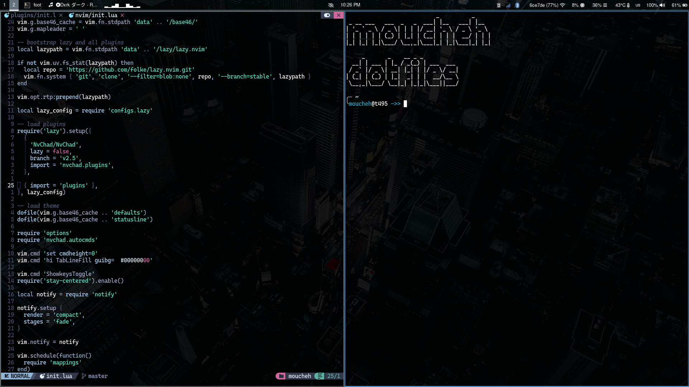
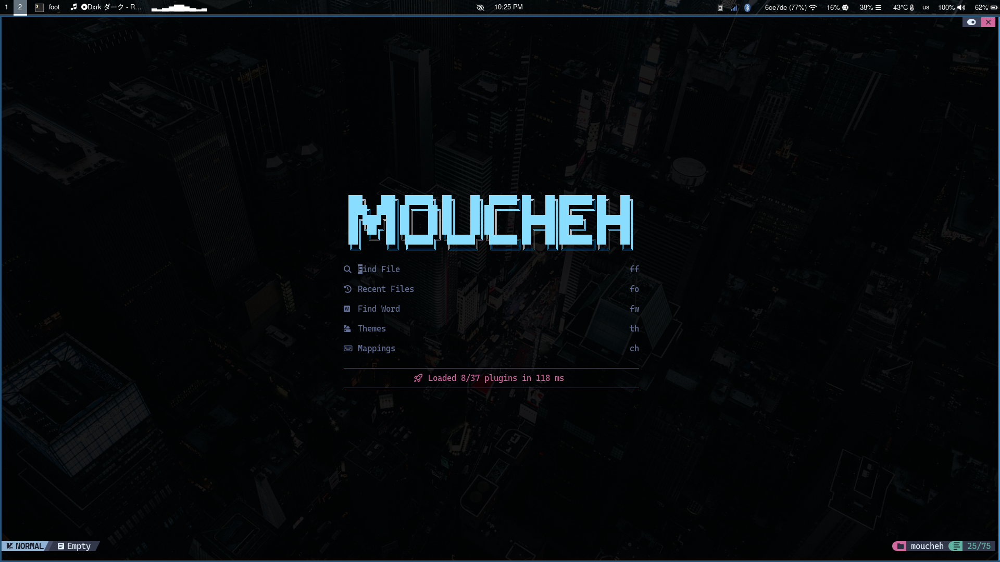
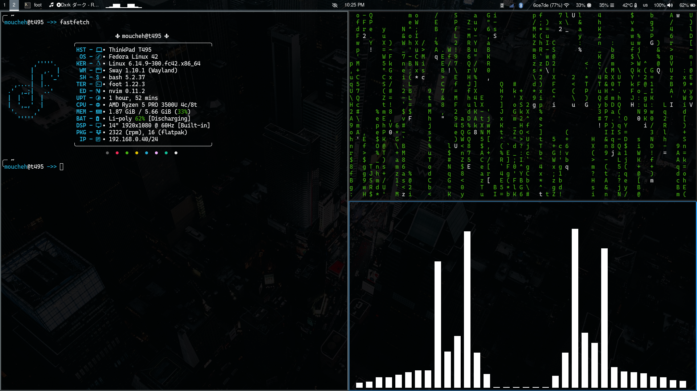
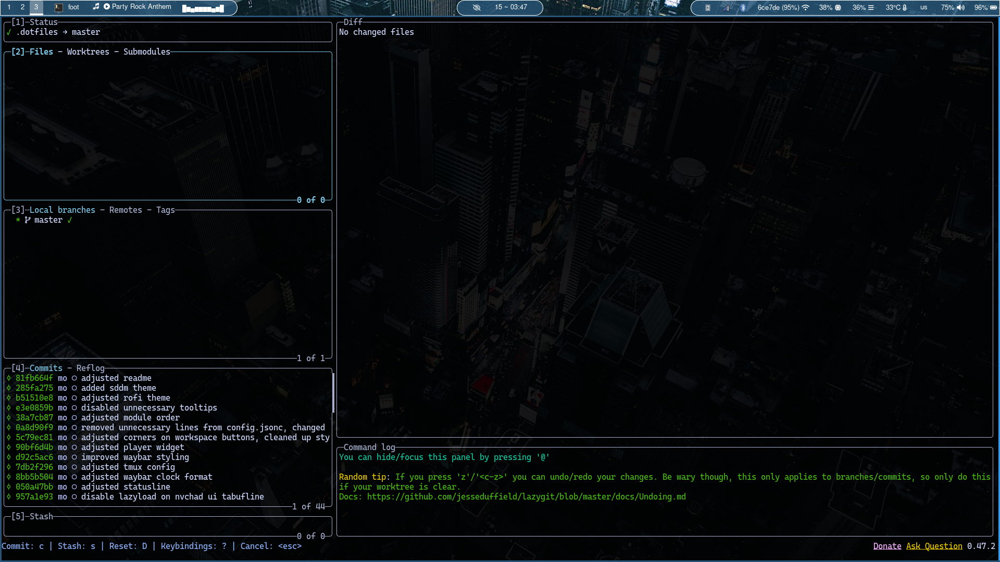
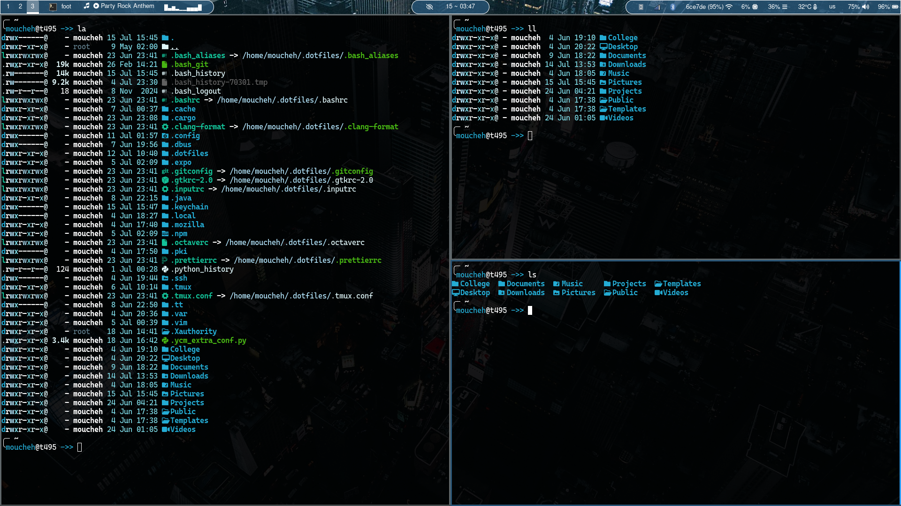
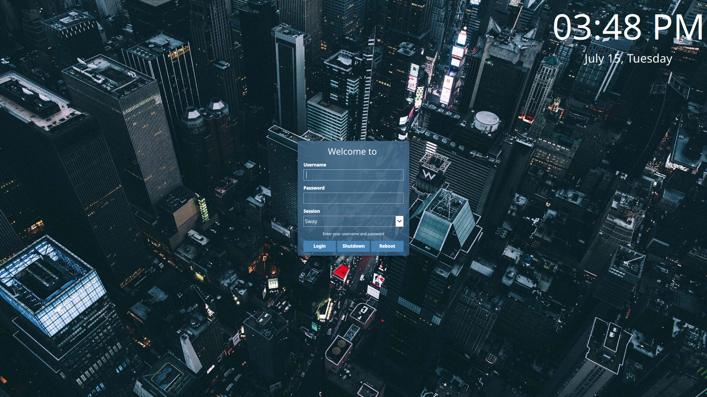

# moucheh Dotfiles

- WM - [sway](https://github.com/moucheh/dotfiles/blob/master/sway/config)
- Bar - [waybar](https://github.com/moucheh/dotfiles/tree/master/waybar)
- Lock manager - [swaylock-effects](https://github.com/jirutka/swaylock-effects)
- Launcher - [rofi](https://github.com/moucheh/dotfiles/blob/master/rofi/config.rasi)
- Terminal - [foot](https://github.com/moucheh/dotfiles/blob/master/foot/foot.ini)
- Editor - [nvim](https://github.com/moucheh/dotfiles/tree/master/nvim)
- [Fastfetch](https://github.com/moucheh/dotfiles/blob/master/fastfetch/config.jsonc)
- [Autotiling](https://pypi.org/project/autotiling/)

Make sure to clone the repository in your home directory
    
    git clone https://github.com/moucheh/dotfiles.git $HOME/.dotfiles
    
And then run the install script, you may need to add executable permissions

    chmod +x install.sh
    ./install.sh

If you already have a config for something that is included in these dotfiles, that config will be copied to a backup folder of current date and time, it will start with a dot so, it won't be lost.

For auto tiling to work, you need to install a python package

    pip install autotiling

You may need to make it executable

    chmod +x $(which autotiling)

## Sample images

### Screenshot 1 (main)

### Screenshot 2 (nvim)

### Screenshot 3 (fastfetch + cmatrix + cava)

### Screenshot 4 (lazygit)

### Screenshot 5 (ls replacement -> eza)

### Screenshot 6 (sddm greeter)

