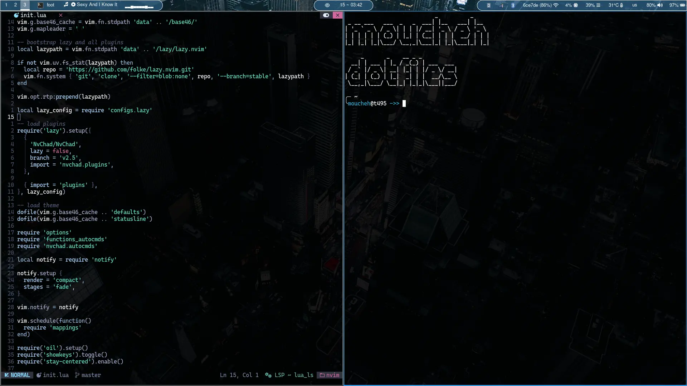
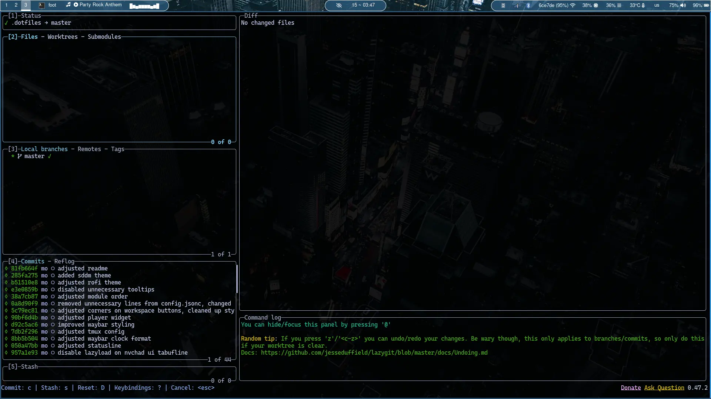
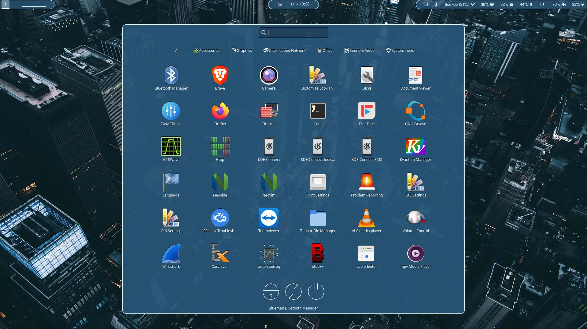

# moucheh Dotfiles

- WM - [sway](https://github.com/moucheh/dotfiles/blob/master/config/sway/config)
- Bar - [waybar](https://github.com/moucheh/dotfiles/tree/master/config/waybar)
- Lock manager - [swaylock-effects](https://github.com/jirutka/swaylock-effects)
- Launcher - [fuzzel](https://github.com/moucheh/dotfiles/blob/master/config/fuzzel/fuzzel.ini)
- Terminal - [foot](https://github.com/moucheh/dotfiles/blob/master/config/foot/foot.ini)
- Editor - [nvim](https://github.com/moucheh/dotfiles/tree/master/config/nvim)
- mvim - [fully native nvim setup no external plugins](https://github.com/moucheh/dotfiles/tree/master/config/mvim)
- Dock - [nwg-dock](https://github.com/moucheh/dotfiles/blob/master/config/nwg-dock/style.css)
- Drawer - [nwg-drawer](https://github.com/moucheh/dotfiles/blob/master/config/nwg-drawer/drawer.css)
- Starship - [starship](https://github.com/moucheh/dotfiles/blob/master/config/starship.toml)
- [Fastfetch](https://github.com/moucheh/dotfiles/blob/master/config/fastfetch/config.jsonc)
- [Autotiling](https://pypi.org/project/autotiling/)

Make sure to clone the repository in your home directory
    
    git clone https://github.com/moucheh/dotfiles.git $HOME/.dotfiles
    
And then run the install script, you may need to add executable permissions

    chmod +x install.sh
    ./install.sh

If you already have a config for something that is included in these dotfiles, that config will be copied to a backup folder of current date and time, it will start with a dot so it will be hiden, but won't be lost.

For autotiling to work, you need to install a python package

    pip install autotiling

You may need to make it executable

    chmod +x $(which autotiling)

To enable sddm theme, you need to copy the 03-sway-fedora contents to /usr/share/sddm/themes,
as well as set it inside /etc/sddm.conf file

    sudo cp -r 03-sway-fedora /usr/share/sddm/themes/
    sudo nvim /etc/sddm.conf

Make sure you have these lines in your config file

```
[Theme]
Current=03-sway-fedora
```

If you'd like to have fingerprint unlocking as well as password unlocking
copy pam.d/swaylock contents to /etc/pam.d/swaylock

    sudo cp etc/pam.d/swaylock /etc/pam.d

You may need to delete the file if it already exists

    sudo rm /etc/pam.d/swaylock

This enables password entry as well as fingerprint scanner login.

I've also added a script that does ascii art generation for nvim dashboard.
Figlet is a dependency, you can install it through your distro's package manager.

    sudo dnf install figlet
    ~/.dotfiles/scripts/nvdash_art.sh moucheh

If you would like to try out the fully native nvim setup (mvim - it has no external plugins), you can run it with the follwoing command

    nvim -u ~/.dotfiles/config/mvim/init.lua

## Sample images

### Screenshot 1 (main)


### Screenshot 2 (nvim)


### Screenshot 3 (fastfetch + cmatrix + cava)


### Screenshot 4 (lazygit)


### Screenshot 5 (ls replacement -> eza)


### Screenshot 6 (sddm greeter)


### Screenshot 7 (nwg-dock)


### Screenshot 8 (fuzzel)


### Screenshot 9 (nwg-drawer)


### Screenshot 10
Clipboard management using wl-clipboard + clipman + fzf

Default keybinds:
- Win+C      - pick an entry
- Win+Alt+C  - clear an entry
- Ctrl+Alt+C - clear all entries


### Full quality background

