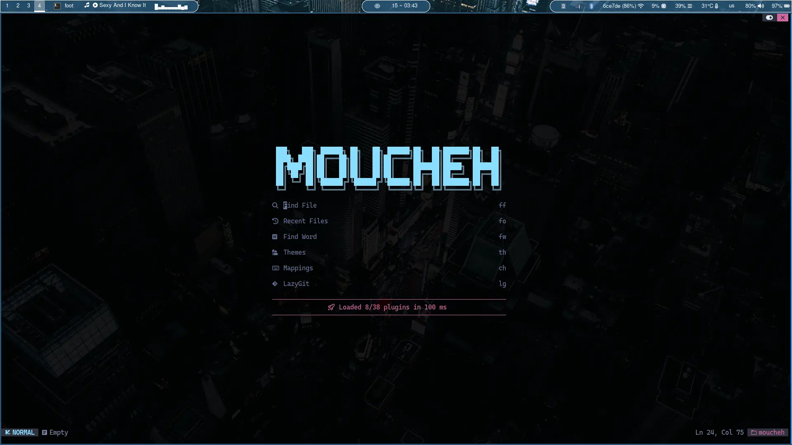
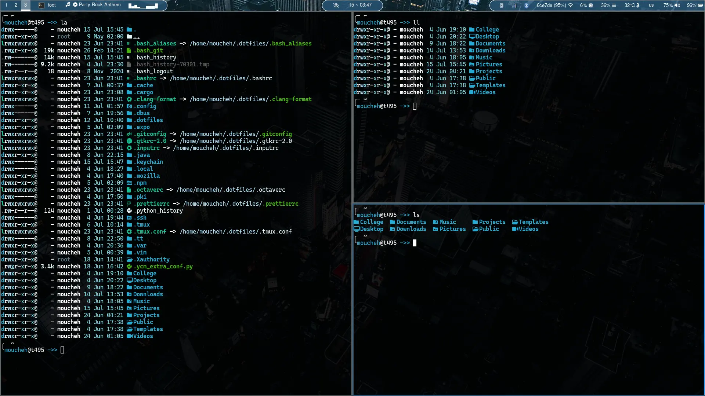
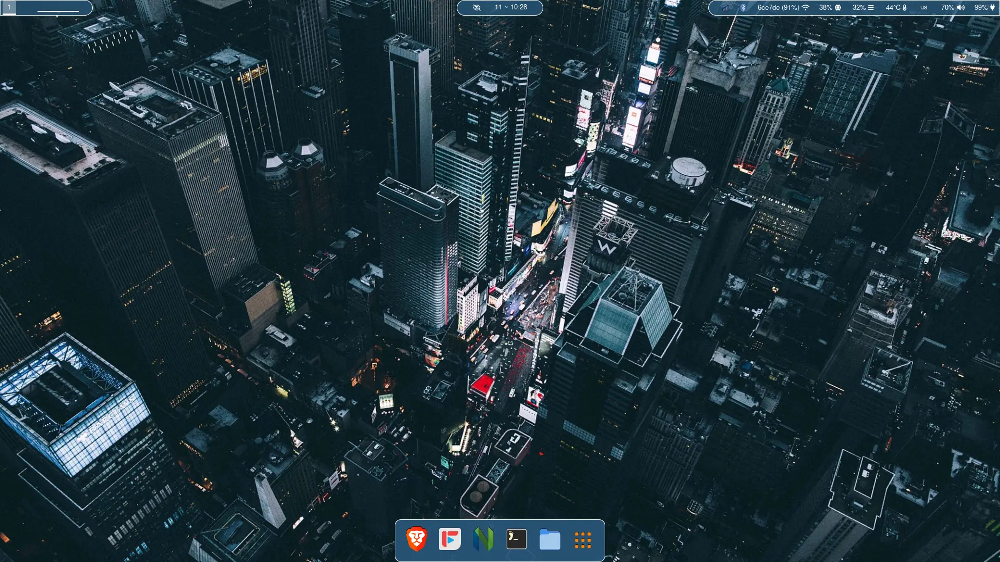
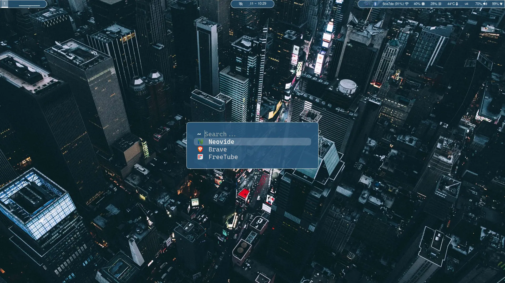
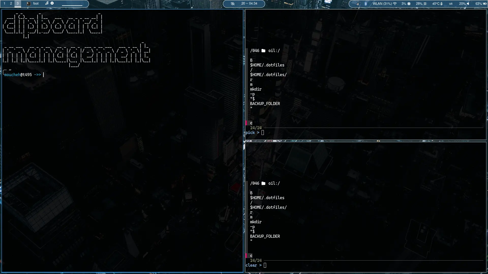

# moucheh Dotfiles

- WM - [niri](https://github.com/moucheh/dotfiles/tree/master/config/niri)
- Bar - [waybar](https://github.com/moucheh/dotfiles/tree/master/config/waybar)
- Login manager - gdm
- Lock manager - [gtklock](https://github.com/moucheh/dotfiles/tree/master/config/gtklock/config.ini)
- Launcher - [fuzzel](https://github.com/moucheh/dotfiles/blob/master/config/fuzzel/fuzzel.ini)
- Terminal - [foot](https://github.com/moucheh/dotfiles/blob/master/config/foot/foot.ini)
- Editor - [nvim](https://github.com/moucheh/dotfiles/tree/master/config/nvim)
- mvim - [fully native nvim setup no external plugins](https://github.com/moucheh/dotfiles/tree/master/config/mvim)
- niri dock - [lavalauncher](https://git.sr.ht/~leon_plickat/lavalauncher)
- Notification center - [SwayNC](https://github.com/ErikReider/SwayNotificationCenter)
- OSD - [SwayOSD](https://github.com/ErikReider/SwayOSD)
- Drawer - [nwggrid](https://github.com/moucheh/dotfiles/blob/master/config/nwg-launchers/nwggrid/style.css)
- Starship - [starship](https://github.com/moucheh/dotfiles/blob/master/config/starship.toml)
- [Fastfetch](https://github.com/moucheh/dotfiles/blob/master/config/fastfetch/config.jsonc)

Make sure to clone the repository in your home directory
    
    git clone https://github.com/moucheh/dotfiles.git $HOME/.dotfiles
    
And then run the install script, you may need to add executable permissions

    chmod +x install.sh
    ./install.sh

If you already have a config for something that is included in these dotfiles, that config will be copied to a backup folder of current date and time, it will start with a dot so it will be hiden, but won't be lost.

I've also added a script that does ascii art generation for nvim dashboard.
Figlet is a dependency, you can install it through your distro's package manager.

    sudo dnf install figlet
    ~/.dotfiles/scripts/nvdash_art.sh moucheh

If you would like to try out the fully native nvim setup (mvim - it has no external plugins), you can run it with the follwoing command

    nvim -u ~/.dotfiles/config/mvim/init.lua

## Sample images

### Screenshot 1 (main)

### Screenshot 2 (nvim)

### Screenshot 3 (nvim lazy pkg manager)

### Screenshot 4 (Overview 1)

### Screenshot 5 (Overview 2)

### Screenshot 6
Clipboard management using wl-clipboard + clipman + fzf

Default keybinds:
- Super+C        - pick an entry
- Super+Shift+C  - clear an entry
- Super+Alt+C    - clear all entries

### Screenshot 7 (eza)

### Screenshot 8 (lazygit)

### Screenshot 9 (yazi)

### Screenshot 10 (fuzzel)

### Screenshot 11 (nwg-drawer)

### Screenshot 12 (lavalauncher)

### Screenshot 13 (swaync)

### Screenshot 14 (swayosd)

### Screenshot 15 (wlogout)

### Screenshot 16 (swaylock)

### Full quality wallpaper

